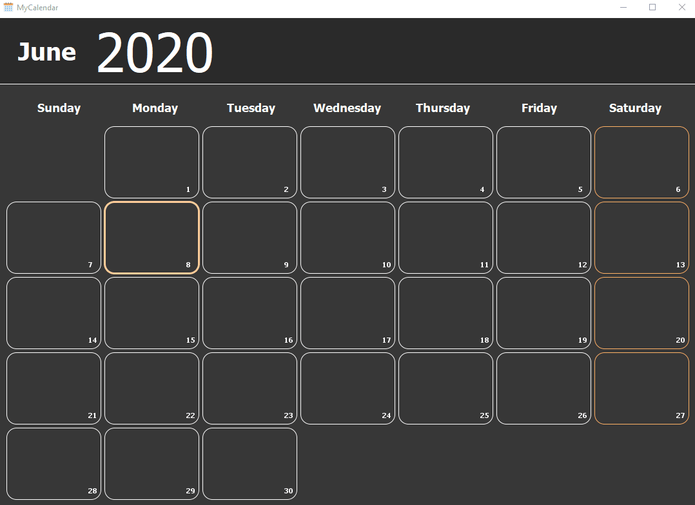

# Calendar
This calendar application was another mini project during a Java course.
it currently implements in-memory database (hash map), which will be switched with PostgeSQL, once i learn how to do it. :sweat_smile:

#### Instructions
- Select the year and month presentation by clicking the corresponding labels in the header
- Click a blank space in a calendar day (box) to open the event editor and add a new event
- To edit an event, click the desired event. the event editor will be open with the event details
- To show more details, click the "Add Details" button

Icons made by <a href="https://www.flaticon.com/authors/freepik" title="Freepik">Freepik</a> from <a href="https://www.flaticon.com/" title="Flaticon"> www.flaticon.com</a>

#### Demo

